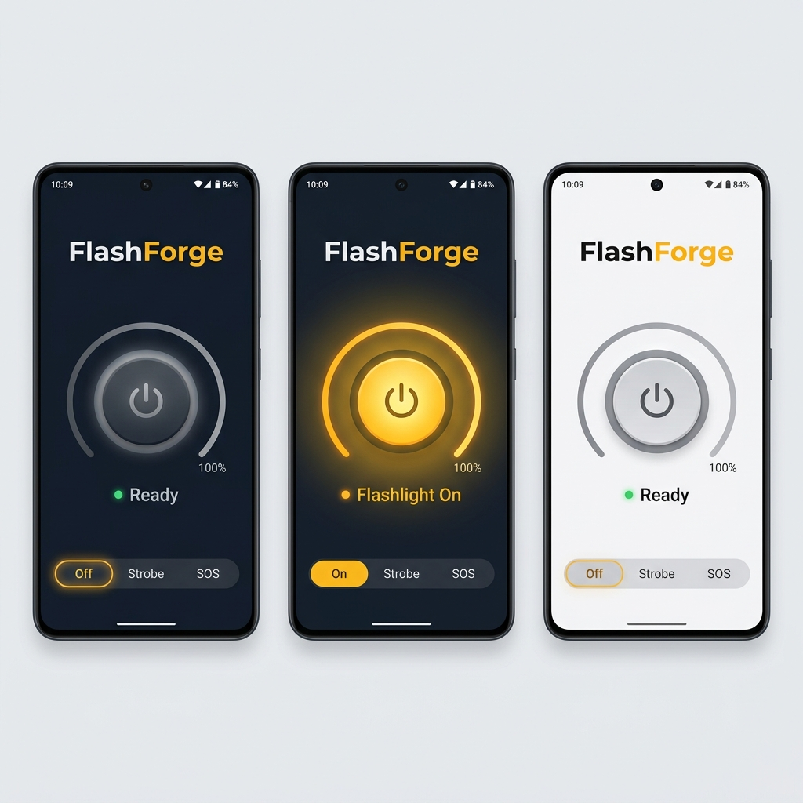
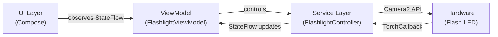

<p align="center">
  
</p>

<p align="center">
  <strong>A beautifully crafted Android flashlight app with intensity control, built with Jetpack Compose & Material 3</strong>
</p>

<p align="center">
  <a href="#features"></a>
  <a href="#compatibility"></a>
  <a href="#tech-stack"></a>
  <a href="#license"></a>
</p>

<p align="center">
  
  
  
  
  
</p>

---

## 📸 Screenshots

<p align="center">
  
</p>

<p align="center">
  <em>Dark Mode (Off) · Dark Mode (On with Glow) · Light Mode</em>
</p>

---

## ✨ Features

### 🔦 Core Flashlight
| Feature | Description |
|:---|:---|
| **Instant Toggle** | Zero permission prompts — tap and the flashlight turns on immediately |
| **Variable Brightness** | Circular arc dial to control torch intensity on supported devices (API 33+) |
| **Strobe Mode** | ~6Hz rapid flash pattern for signaling |
| **SOS Mode** | Proper Morse code pattern (··· ——— ···) with accurate timing |
| **Morse Code Messaging** | Type any text message and transmit it as flash signals using International Morse Code |
| **Auto-Off** | Flashlight automatically turns off when the app goes to background |

### 🎨 Premium Design
| Feature | Description |
|:---|:---|
| **Animated Power Button** | Scale bounce on press, gray → amber color morph, pulsing outer glow ring |
| **Ambient Glow Effect** | Full-screen radial gradient that pulses with the flashlight state |
| **Circular Intensity Dial** | 270° arc slider with thumb, tick marks, center percentage display |
| **Smooth Transitions** | Every state change animates — colors, scales, visibility, text |
| **Haptic Feedback** | Tactile response on toggle and brightness changes (every 10% step) |

### 🌓 Theming
| Feature | Description |
|:---|:---|
| **Material You** | Dynamic color schemes from wallpaper on Android 12+ |
| **Dark Mode** | Hand-crafted deep navy palette with amber accents |
| **Light Mode** | Clean white/gray palette with warm amber highlights |
| **Manual Toggle** | Switch between dark and light from the top bar |
| **Google Fonts** | Inter typeface — modern, clean, highly readable |

### 📡 Morse Code Utilities
| Feature | Description |
|:---|:---|
| **Text-to-Flash Transmitter** | Type paragraphs and transmit them as light signals using ITU Morse code timing |
| **Real-time Preview** | Display the full dot/dash Morse sequence as you type |
| **Camera Morse Decoder** | Live camera analysis translating light pulses back to text on-screen |
| **Viewfinder Target HUD** | Guided target box overlays indicating sample region for optimal analysis |
| **Dynamic Thresholding** | Automatic luminance calibration adjusting to background room lighting |

### 🚀 User Experience (UX)
| Feature | Description |
|:---|:---|
| **Premium Onboarding** | Multipager sliding cards on first run introducing app utilities |
| **Permission Dialogue** | Secure pre-consent glassmorphic details explaining local processing |
| **Targeted Ambient Glow** | Pulsing radial gradients positioned exactly behind toggle keys |
| **Haptic Feedback** | Tactile vibrations on keys and dial slider ticks |
| **Clipboard Copy** | Quick copy button overlays for translated and decoded Morse text |
| **Clean Navigation** | Custom indicator tabs to slide between torch controls and camera decoder |


### 📱 Compatibility & Orientation
| Feature | Description |
|:---|:---|
| **Android 9–16+** | minSdk 28, targetSdk 36 — broadest modern coverage |
| **Landscape Support** | Adaptive two-column layout in landscape orientation |
| **Orientation Changes** | Smooth UI transitions when rotating the device |
| **Graceful Degradation** | Intensity dial only appears on devices that support it |
| **No Permissions** | Torch API doesn't require CAMERA permission |
| **Edge-to-Edge** | Immersive display with transparent system bars |

---

## 🏗️ Architecture

```
FlashForge/
├── app/src/main/java/com/truelokal/flashforge/
│   ├── MainActivity.kt                 # Single Activity entry point
│   ├── FlashForgeApp.kt                # Root Composable + Theme wrapper
│   │
│   ├── service/

│   │   └── FlashlightController.kt     # Camera2 API hardware abstraction
│   │
│   ├── viewmodel/
│   │   └── FlashlightViewModel.kt      # State management + strobe + Morse engine
│   │
│   └── ui/
│       ├── theme/
│       │   ├── Color.kt                # Curated color palette
│       │   ├── Theme.kt                # M3 dynamic + fallback themes
│       │   └── Type.kt                 # Inter typography system
│       │
│       ├── screens/
│       │   └── FlashlightScreen.kt     # Adaptive portrait/landscape layout
│       │
│       └── components/
│           ├── PowerButton.kt          # Animated power toggle
│           ├── IntensityDial.kt        # Circular brightness slider
│           ├── GlowEffect.kt           # Radial ambient glow
│           ├── StrobeControls.kt       # Mode selector chips
│           ├── MorseCodePanel.kt       # Text-to-Morse input + progress
│           └── StatusIndicator.kt      # Animated state display
│
├── app/src/main/res/                   # Resources, icons, strings
├── gradle/libs.versions.toml           # Version catalog
└── build.gradle.kts                    # Build configuration
```

### Architecture Pattern



---

## 🛠️ Tech Stack

| Component | Version | Purpose |
|:---|:---|:---|
| **Kotlin** | 2.1.0 | Primary language |
| **Jetpack Compose** | BOM 2025.01.01 | Declarative UI framework |
| **Material 3** | via BOM | Design system + dynamic theming |
| **Lifecycle ViewModel** | 2.8.7 | State management |
| **Activity Compose** | 1.9.3 | Compose integration |
| **Google Fonts** | via Compose UI Text | Inter typeface |
| **Camera2 API** | Platform | Torch control + intensity |
| **AGP** | 8.7.3 | Build system |

---

## 🚀 Getting Started

### Prerequisites

- **Android Studio** Hedgehog (2023.1.1) or later
- **JDK 11** or higher
- **Android SDK** with API 36 installed
- A **physical Android device** with a flash LED (emulators don't have flash hardware)

### Build & Run

```bash
# Clone the repository
git clone https://github.com/yourusername/FlashForge.git
cd FlashForge

# Build the debug APK
./gradlew assembleDebug

# Install on connected device
./gradlew installDebug
```

Or simply open the project in **Android Studio** and click **Run** ▶️.

### Build Variants

| Variant | Command | Description |
|:---|:---|:---|
| Debug | `./gradlew assembleDebug` | Development build with debugging |
| Release | `./gradlew assembleRelease` | Minified + shrunk production build |

---

## 📋 How It Works

### Flashlight Control

FlashForge uses the **Camera2 API** for all flashlight operations — no deprecated APIs, no CAMERA permission needed:

```kotlin
// Basic on/off (all devices, API 23+)
cameraManager.setTorchMode(cameraId, true)

// Variable intensity (API 33+, hardware-dependent)
if (Build.VERSION.SDK_INT >= Build.VERSION_CODES.TIRAMISU) {
    cameraManager.turnOnTorchWithStrengthLevel(cameraId, level)
}
```

### Intensity Detection

Not all devices support variable brightness. FlashForge detects this at startup:

```kotlin
val maxLevel = characteristics.get(
    CameraCharacteristics.FLASH_INFO_STRENGTH_MAXIMUM_LEVEL
)
// maxLevel > 1 → variable intensity supported
// maxLevel == 1 → on/off only
```

If brightness control isn't available, the intensity dial is **hidden** and replaced with an info card — keeping the UI clean.

### Strobe/SOS Engine

Patterns are driven by **Kotlin coroutines** with precise timing:

```kotlin
// SOS: ··· ——— ···
repeat(3) { controller.turnOn(); delay(150); controller.turnOff(); delay(150) }  // S
repeat(3) { controller.turnOn(); delay(450); controller.turnOff(); delay(150) }  // O
repeat(3) { controller.turnOn(); delay(150); controller.turnOff(); delay(150) }  // S
```

### Morse Code Messaging

Users type a text message and the app translates it to **International Morse Code**, then transmits each character as flash signals using ITU-standard timing:

```kotlin
// Morse code timing (base unit = 120ms)
// · (dot)  = 1 unit ON    |  — (dash) = 3 units ON
// Intra-character gap = 1 unit OFF
// Inter-character gap = 3 units OFF
// Word gap (space)    = 7 units OFF

// Example: "HELLO" → ···· · ·—·· ·—·· ———
for ((char, morse) in message) {
    for (signal in morse) {
        controller.turnOn()
        delay(if (signal == '·') UNIT_MS else UNIT_MS * 3)
        controller.turnOff()
    }
}
```

The panel shows a **real-time preview** of the Morse translation, a **progress bar**, and the **currently transmitting character** — all with smooth animations.

### Adaptive Orientation

The UI detects orientation via `LocalConfiguration` and renders different layouts:

```kotlin
val configuration = LocalConfiguration.current
val isLandscape = configuration.orientation == Configuration.ORIENTATION_LANDSCAPE

if (isLandscape) LandscapeLayout(...) else PortraitLayout(...)
```

- **Portrait**: Vertical scroll — power button → intensity → modes → Morse
- **Landscape**: Two-column `Row` — left panel (power + intensity), right panel (modes + Morse)

All elements are scrollable in both orientations to handle smaller screens and keyboard visibility.

---

## 🎨 Design System

### Color Palette

| Color | Hex | Usage |
|:---|:---|:---|
| 🟡 Accent Amber | `#FFB800` | Primary accent, active state, glow |
| 🟡 Accent Light | `#FFD54F` | Highlight, secondary accent |
| 🔵 Dark Background | `#0D0D1A` | Dark theme background |
| 🔵 Dark Surface | `#1A1A2E` | Dark theme cards/surfaces |
| ⚪ Light Background | `#F5F5FA` | Light theme background |
| 🟠 Strobe Orange | `#FF6B35` | Strobe mode accent |
| 🔴 SOS Red | `#FF3D3D` | SOS mode accent |
| 🟢 Success Green | `#4CAF50` | Ready state indicator |

### Typography

**Inter** via Google Fonts — chosen for its clean, modern appearance and excellent readability at all sizes. The font is downloaded at runtime (no bundled font files) to keep APK size minimal.

---

## 🔧 Configuration

### Changing Target SDK

Update `compileSdk` and `targetSdk` in `app/build.gradle.kts`:

```kotlin
android {
    compileSdk = 36
    defaultConfig {
        targetSdk = 36
    }
}
```

### Customizing the Strobe Speed

In `FlashlightViewModel.kt`, modify the delay values:

```kotlin
// Current: ~6Hz strobe
controller.turnOn(); delay(80)
controller.turnOff(); delay(80)

// Slower: ~3Hz
controller.turnOn(); delay(160)
controller.turnOff(); delay(160)
```

### Disabling Dynamic Colors

In `Theme.kt`, set `dynamicColor = false`:

```kotlin
FlashForgeTheme(dynamicColor = false) { ... }
```

---

## 📱 Compatibility

| Android Version | API Level | Status | Notes |
|:---|:---|:---|:---|
| Android 9 (Pie) | 28 | ✅ Full | On/off only, custom theme |
| Android 10 | 29 | ✅ Full | On/off only, custom theme |
| Android 11 | 30 | ✅ Full | On/off only, custom theme |
| Android 12 | 31 | ✅ Full | + Material You dynamic colors |
| Android 12L | 32 | ✅ Full | + Material You dynamic colors |
| Android 13 | 33 | ✅ Full | + Brightness control (if hardware supports) |
| Android 14 | 34 | ✅ Full | + Brightness control |
| Android 15 | 35 | ✅ Full | + Brightness control |
| Android 16 | 36 | ✅ Full | Target SDK |

> **Note:** Variable brightness requires both API 33+ **and** device hardware that reports `FLASH_INFO_STRENGTH_MAXIMUM_LEVEL > 1`. On devices without hardware support, FlashForge gracefully falls back to on/off mode.

---

## 📦 APK Size

FlashForge is designed to be lightweight:

- **No network permissions** — fully offline
- **No third-party SDKs** — no analytics, no ads
- **Google Fonts downloaded at runtime** — no bundled font files
- **Vector icons only** — no raster image assets
- **R8 minification** enabled in release builds

---

## 🤝 Contributing

Contributions are welcome! Here's how to get started:

1. **Fork** the repository
2. **Create** a feature branch (`git checkout -b feature/amazing-feature`)
3. **Commit** your changes (`git commit -m 'Add amazing feature'`)
4. **Push** to the branch (`git push origin feature/amazing-feature`)
5. **Open** a Pull Request

### Development Guidelines

- Follow [Kotlin coding conventions](https://kotlinlang.org/docs/coding-conventions.html)
- Use Material 3 components and the existing design system
- Add haptic feedback for interactive elements
- Ensure animations are smooth (target 60fps)
- Test on both dark and light themes
- Support Android 9+ (don't raise minSdk)

---

## 📄 License

```
MIT License

Copyright (c) 2026 FlashForge

Permission is hereby granted, free of charge, to any person obtaining a copy
of this software and associated documentation files (the "Software"), to deal
in the Software without restriction, including without limitation the rights
to use, copy, modify, merge, publish, distribute, sublicense, and/or sell
copies of the Software, and to permit persons to whom the Software is
furnished to do so, subject to the following conditions:

The above copyright notice and this permission notice shall be included in all
copies or substantial portions of the Software.

THE SOFTWARE IS PROVIDED "AS IS", WITHOUT WARRANTY OF ANY KIND, EXPRESS OR
IMPLIED, INCLUDING BUT NOT LIMITED TO THE WARRANTIES OF MERCHANTABILITY,
FITNESS FOR A PARTICULAR PURPOSE AND NONINFRINGEMENT. IN NO EVENT SHALL THE
AUTHORS OR COPYRIGHT HOLDERS BE LIABLE FOR ANY CLAIM, DAMAGES OR OTHER
LIABILITY, WHETHER IN AN ACTION OF CONTRACT, TORT OR OTHERWISE, ARISING FROM,
OUT OF OR IN CONNECTION WITH THE SOFTWARE OR THE USE OR OTHER DEALINGS IN THE
SOFTWARE.
```

---

<p align="center">
  Made with 🔦 and ❤️ using Jetpack Compose
</p>

<p align="center">
  <a href="#-screenshots">Screenshots</a> · <a href="#-features">Features</a> · <a href="#-getting-started">Get Started</a> · <a href="#-contributing">Contributing</a>
</p>
